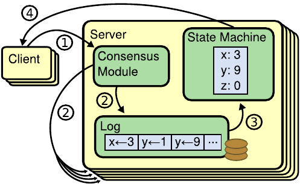

# Example Systems Course - 2024 Midterm Exam

```json
{
  "exam_id": "example_course_2024_midterm",
  "test_paper_name": "Example Systems Course: 2024 Midterm Exam",
  "course": "Example Systems Course",
  "institution": "Example University",
  "year": 2024,
  "category": "Operating Systems",
  "score_total": 59,
  "score_max": 59.0,
  "score_avg": 42.0,
  "score_median": 43,
  "score_standard_deviation": 9.0,
  "num_questions": 10
}
```

---

## Question 1 [5 points]

What state is a process in when it is waiting for I/O to complete?

```json
{
  "problem_id": "1",
  "points": 5,
  "type": "ExactMatch",
  "tags": ["operating-systems", "processes"],
  "choices": ["Running", "Ready", "Blocked", "Terminated"],
  "answer": "C",
  "comments": "Multiple choice question. The choices field is required for ExactMatch questions with options."
}
```

---

## Question 2 [5 points]

True or False: A race condition occurs when multiple threads access shared data concurrently and at least one thread modifies the data.

```json
{
  "problem_id": "2",
  "points": 5,
  "type": "ExactMatch",
  "tags": ["operating-systems", "concurrency"],
  "choices": ["True", "False"],
  "answer": "A"
}
```

---

## Question 3 [10 points]

Explain the purpose of a Translation Lookaside Buffer (TLB) in a virtual memory system.

Your answer should be a brief explanation (about 2-3 sentences).

```json
{
  "problem_id": "3",
  "points": 10,
  "type": "Freeform",
  "tags": ["operating-systems", "virtual-memory"],
  "answer": "The TLB is a hardware cache that stores recent virtual-to-physical address translations. It improves performance by avoiding the need to access the page table in memory for every memory reference. Since the TLB is much faster than main memory, most address translations can be done quickly using the cached entries.",
  "comments": "Free-form explanation. Default LLM-as-judge will evaluate quality, completeness, and accuracy then assign points out of 10."
}
```

---

## Question 4 [10 points]

Describe the two phases of the two-phase commit protocol.

Your answer should include a brief description of each phase (about 1-2 sentences each).

```json
{
  "problem_id": "4",
  "points": 10,
  "type": "Freeform",
  "tags": ["distributed-systems", "consensus"],
  "answer": "Phase 1 (Prepare): The coordinator sends PREPARE messages to all participants. Each participant votes YES if ready to commit or NO if it must abort. Phase 2 (Commit/Abort): If all participants vote YES, the coordinator sends COMMIT to all. If any vote NO, the coordinator sends ABORT to all.",
  "llm_judge_instructions": "Phase 1 description (5 points): Award full points for explaining prepare/vote phase. Phase 2 description (5 points): Award full points for explaining commit/abort decision.",
  "comments": "Multi-part question with custom rubric. Custom rubric ensures each part is weighted correctly."
}
```

---

## Question 5 [5 points]

Which of the following operations modify the inode? (Select all that apply)

A. Changing file permissions

B. Reading file contents

C. Changing file size

```json
{
  "problem_id": "5",
  "points": 5,
  "type": "Freeform",
  "tags": ["operating-systems", "file-systems"],
  "choices": [
    "Changing file permissions",
    "Reading file contents",
    "Changing file size"
  ],
  "answer": "The operations that modify the inode are: A (Changing file permissions) and C (Changing file size). Reading file contents (B) does not modify the inode.",
  "llm_judge_instructions": "Award full 5 points if the student correctly identifies both A and C. Award 0 points for any other answer. Acceptable formats include: 'A, C', 'A and C', 'A & C', or explaining that A and C are correct.",
  "comments": "Multiple choice with multiple correct answers. Since we can't use ExactMatch for multi-select, we use Freeform with LLM judge."
}
```

---

## Question 6 [10 points]

Which statements about CPU scheduling are true? (Select all that apply)

A. Round-robin can lead to starvation

B. SJF minimizes average waiting time

C. Priority scheduling can have priority inversion

Your answer should be a comma-separated list of letters only (no extra text). For example: "A, B"

```json
{
  "problem_id": "6",
  "points": 10,
  "type": "Freeform",
  "tags": ["operating-systems", "scheduling"],
  "answer": "B, C",
  "llm_judge_instructions": "Correct: B, C. Award 10 points for B, C. Award 6 points for only B or only C. Award 0 if A is selected (incorrect).",
  "comments": "Multiple choice with partial credit. Freeform type with rubric allows rewarding incomplete but correct answers while penalizing wrong choices."
}
```

---

## Question 7 [Excluded - 5 points]

Consider the Raft state diagram shown in Figure 1 below.



Based on the diagram, which transitions require a timeout?

> [!NOTE]
> CANNOT BE INCLUDED - References a figure/image. The benchmark cannot process visual content.
>
> Action:
>
> - Do NOT add to questions.jsonl
> - DEDUCT 5 points from the exam total: 64 - 5 = 59 points
> - Reduce question count: 11 → 10 questions (note: multi-part questions count as separate entries)

---

## Question 8 [3 points]

Refer to the Raft Algorithm Reference.

True or False: A candidate must receive votes from a majority of servers to become leader.

Your answer should be either "True" or "False" only. No extra text.

```json
{
  "problem_id": "8",
  "points": 3,
  "type": "ExactMatch",
  "tags": ["distributed-systems", "raft"],
  "reference_materials": ["raft_basics.md"],
  "choices": ["True", "False"],
  "answer": "A",
  "comments": "ExactMatch with reference material. The reference .md file is provided to the LLM like a cheatsheet."
}
```

---

## Question 9 [7 points]

Refer to the Raft Algorithm Reference.

What are the three possible outcomes when a candidate runs for election? List all three.

Your answer should list the three outcomes in a single response (one to two sentences each).

```json
{
  "problem_id": "9",
  "points": 7,
  "type": "Freeform",
  "tags": ["distributed-systems", "raft"],
  "reference_materials": ["raft_basics.md"],
  "answer": "The three possible outcomes are: 1) The candidate wins the election by receiving votes from a majority of servers and becomes leader, 2) Another server wins the election and the candidate discovers the new leader and converts to follower, 3) Election timeout occurs with no winner (split vote), causing the candidate to start a new election.",
  "llm_judge_instructions": "Award 2-3 points for each outcome mentioned: 1) wins election, 2) another server wins, 3) timeout/no winner.",
  "comments": "Freeform with reference material and custom rubric. Custom rubric splits points across the three outcomes."
}
```

---

## Question 10.1 [2 points]

True or False: In Paxos, a proposer must receive responses from a majority of acceptors to achieve consensus.

Your answer should be either "True" or "False" only. No extra text.

```json
{
  "problem_id": "10.1",
  "points": 2,
  "type": "ExactMatch",
  "tags": ["distributed-systems", "paxos", "consensus"],
  "choices": ["True", "False"],
  "answer": "A",
  "comments": "Multi-part True/False question. Must be split into separate questions with sub-problem IDs."
}
```

---

## Question 10.2 [2 points]

True or False: The CAP theorem states that a distributed system can simultaneously guarantee Consistency, Availability, and Partition tolerance.

Your answer should be either "True" or "False" only. No extra text.

```json
{
  "problem_id": "10.2",
  "points": 2,
  "type": "ExactMatch",
  "tags": ["distributed-systems", "cap-theorem"],
  "choices": ["True", "False"],
  "answer": "B",
  "comments": "Multi-part True/False question. Must be split into separate questions with sub-problem IDs."
}
```
